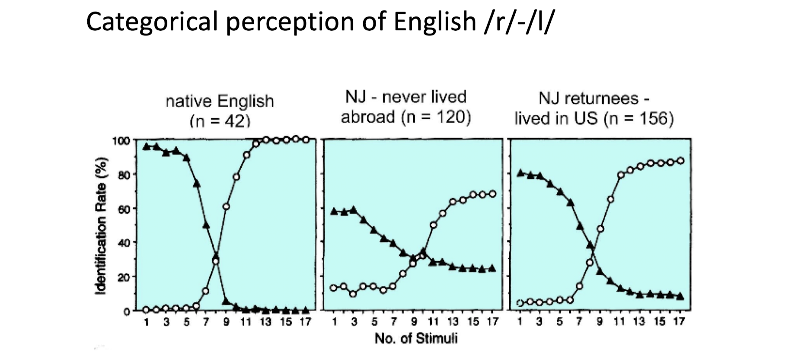
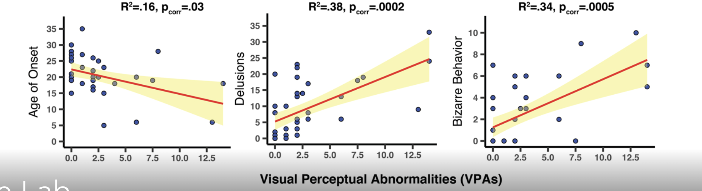

# Portfolio

  
Table of Contents

  <a href="https://github.com/helenabardsley/portfolio/##about">About Me</a>
  <a href="https://github.com/helenabardsley/portfolio/blob/main/index.md##projects">Projects</a>
  <a href="https://github.com/helenabardsley/portfolio/blob/main/index.md##skills">Skills</a>

---
## About Me
---

 Hi, I'm Helena, a <b>data-driven storyteller</b> who enjoys <b>visualizing complex insights</b> to reveal the bigger picture, and translating them into <b>actionable strategies.</b> 
 
 

 I realized how transformative data can be a couple of years ago, when my parents were moving and my mom unearthed a box containing a mountain of data, all about me. I found myself pouring over everything from developmental assessments to IQ tests, standardized test results to head circumference monitoring. My speech and large skull had produced years of data, while annual school district testing compared my progress to peers from both my school and across the state, using an array of visualization tools. I have always enjoyed statistics and dealing with data in my classes and research, but seeing analysis about my own development, most of it from a time I don’t remember, was especially fascinating and insightful and it has helped me understand myself better. The realization that data provides insight for arguably everything, from the projection of my own development to broader societal trends, fueled my passion for data-driven research. 

 

 My choice to double major in Brain and Cognitive Sciences (BS) and Psychology (BA), with a minor in Bioethics, was made to allow me to explore human decision making. Through my courses and research, I have become fascinated by how human behavior intersects with data, and this field is something I hope to combine with data analysis as a career. 

 

 

 Now, as a graduate student at Columbia University studying Applied Analytics (MS), I am learning how to combine my knowledge of human behavior with data analysis to derive meaningful insights and make accurate predictions. Beyond uncovering patterns, I love using data to look forward, to predict future trends and outcomes, and to guide decision-making. Data is such a powerful tool, not just for understanding the "how" or the "why", but also for improvement and change, with the potential to make the world a better place. My goal is to work for a company where I contribute to positive change by leveraging data insights to solve problems and shape a better future. 

 

 Sure, you could glance at my resume and see the technical experience and relevant work I have done, but a single page cannot fully capture my enthusiasm, excitement, and dedication to data-driven work. As you read through my portfolio, I hope you begin to understand me, and how my rather untraditional path of education makes me an excellent candidate for a data-related internship or role. 

 

Currently, I am seeking <b>internships for Summer 2025</b> (or full-time positions) at a company where I can apply my skills to <b>make a difference</b>. I am excited about any oppertunity to learn, contribute, and grow through data. 

 

---
## Projects
---
### Kaggle Competition: Predict Click-Through Rate (CTR) using Lasso, Ridge, XGBoost and LightGBM

Using R, I performed comprehensive <b>exploratory data analysis</b> to understand important variables, handled missing values, outliers, performed feature engineering, and ensembled machine learning models to predict CTR, all while not overfitting my predictive model. After testing a variety of different techniques, my best model used XGBoost and had a Residual Mean Squared Error (RMSE) of 0.06186, and out of all of my classmates in my program, I ranked <b>37/400</b>, which is approximately <b>top 10%</b> in the Kaggle leaderboard.

 

 

### Peloton's Post-Pandemic Pivot: A Strategic Analysis of Growth, Retention, and Market Position

In this project, my team and I conducted a strategic analysis of growth, retention, and market position for Peloton, investigating the factors leading to their company's decline in revenue post-COVID-19.

 

I used Tableau to design dashboards and visualizations, which I combined into a comprehensive storyboard. I conducted thorough research and performed my own calculations to find and analyze data on revenue trends, customer attrition, competitive positioning, and develop strategic recommendations. These visualizations highlighted key insights, including a misalignment between Peloton’s product offerings and their shifting consumer fitness preferences since the pandemic. The customer attrition analysis revealed emerging trends in the fitness industry, such as the shift to hybrid workout models and the growing popularity of strength training, which differs from Peloton’s current focus areas like cycling and rowing.

 

With my team, we presented strategic data-driven recommendations, including product diversification into strength-based programs, enhanced marketing for app-only subscriptions, and partnerships to expand Peloton’s reach. These strategies aimed to align Peloton’s offerings with consumer demands and improve long-term customer retention.

 

This project deepened my expertise in using data analytics to solve complex business problems, with a strong focus on visualization, consumer behavior, and strategic decision-making. It also reinforced my passion for leveraging data to drive impactful solutions in fast-paced, consumer-focused industries.

   
 

 

<u>Quick Overview:</u> Since the COVID-19 pandemic, Peloton has seen a tremendous drop in their annual revenue. Working with a team, we leveraged <b>competitor analysis, customer analysis, </b> and <b>market insights</b> to identify growth oppertunities for Peloton in these post-pandemic times. We made an <b>interactive tableau storyboard</b> to effectively present our project. 

 

### The Impact of Live-Stream Shopping on Large Fashion Brands: A Case Study at Zara

 My team and I explored live-stream shopping as a strategy for Zara, a global fashion brand known for its physical presence, but their website's user interface (UI) has been often criticized in the media for its poor usability, lack of navigational aids, and confusing layout. Inspired by the success of small businesses on TikTok Shop, we investigated if live-stream shopping could address Zara’s usability challenges and improve sales, customer engagement, and purchase volume. 

 

Live-stream shopping bridges the gap between physical and digital retail, allowing customers to interact with employees from home. Additionally, humans are visual creatures, and we perceive our environment best with motion. Clearer product demonstrations through live-stream may reduce return rates, lowering CO2 emissions and packaging waste, driving sustainability. Looking ahead, live-stream shopping could enable advanced innovations like AI-powered virtual try-ons, transforming the online shopping experience. And if successful, this could position Zara as a leader in retail innovation, setting new industry standards.

 

We designed a randomized experimental study with 400 U.S. based Zara customers, divided into control and live-stream intervention groups. Our key metrics were sales profit, click-through rates (CTR), and purchase volume. Using R, I conducted simulation studies based on thoroughly researched effect sizes to explore no effect and expected effect scenarios. ANOVA, two-sample t-tests, and proportion tests were applied. There were 1,000 simulations per scenario, and for each scenario, we estimated true effects, calculated confidence intervals, and assessed the likelihood of false positives and negatives. Our simulations provided valuable insights and a foundation for future implementation. With our proposed effect sizes, our findings suggest live-stream shopping could enhance customer engagement and purchasing decisions. 

 

 

<u>Quick Overview:</u> <b>Designed a study</b> to evaluate the impact of implementing live-stream shopping at Zara, <b>defining success metrics</b> and uncovering strategies to boost customer engagement and online shopping frequency. 

 

### Multilingual Differences in Speech Perception and Word Learning

 During the summer of 2023, I worked with my Principal Investigator and 3 time former professor, Dr. Yang, on a project exploring speech perception and word learning differences among multilingual participants. My primary responsibilities included fitting participants with EEG caps to monitor brain activity during speech perception tests, and <b>processed the data</b> using <b>MATLAB</b>. Specifically, I <b>filtered</b> out irrelevant signals from the EEG data to isolate relevant brain signals and identified and removed artifact-ridden epochs, ensuring the accuracy and reliability of our data. Additionally, I conducted independent component analysis to separate and analyze the brain activity components further. 

 

 

### Investigating Visual Deficits in Schizophrenia Patients

I contributed to a research project investigating the role of eye movements alone in detecting schizophrenia. Under the guidance of my Principal Investigator (PI), who hypothesized that schizophrenic patients' visual perception deficits could lead to a new schizophrenia detection methodology, we reviewed existing scientific evidence on these deficits and developed a simple visual detection task to test this hypothesis. Our study included a variety of healthy, bipolar, and schizophrenic patients, and my role was to analyze the data from their performances on a carefully designed visual detection task, and compare performances amongst groups. 

 

To organize the data collected, I used <b>Python</b> to compile and preprocess all of the data into a single, structured <b>Excel</b> file. Then, using <b>R</b> for <b>statistical analysis</b>, I read in the Excel file, and conducted <b>ANOVA testing</b> to detect if there were significant differences between the three groups in timing and accuracy of the visual perception task. Additionally, I created graphical displays of the data using the <b>ggplot2</b> package in <b>R</b>. 

 

At the conclusion of my time in the lab, I presented my findings to my research team and colleagues in the Neuroscience department using <b>Microsoft PowerPoint</b>. My presentation covered the study’s background, methodology, results, and their implications for future research, as well as my concerns about our current research design, and suggestions how to improve our study's robustness.

 

 

<u>Quick Overview:</u> Used <b>Python</b> for <b>data preprocessing</b> and <b>R</b> for <b>statistical analysis</b> and <b>data visualization</b>. Presented the study's research design, results from statistical testing, and recommendations for future research by emphasizing ways to improve the study's robustness. 

 

---
## Dashboards
---
### Visualizing Data on Maps in Tableau

Using <b>Tableau</b> dashboards, I visualized child poverty rates across the United States for every 5 years between 2007 and 2022. Not only did I learn how to visualize multiple layers and dimensions of data on a geographical map, but I also learned the importance color has on conveying your message and making your visualization easy to comprehend. 

 

 

---
## Education
### Columbia University
M.S., Applied Analytics
- GPA: 4.0

<b><u>Relevant Coursework:</u></b> 
- <b>Applied Analytics in an Organizational Context:</b> Excel...
- <b>Research Design:</b> Learned designing studies, simulation studies, different statistics concepts...
- <b>Storytelling with Data:</b> Data visualization tableau...
- <b>Applied Analytics Frameworks & Methods I and II:</b> In the first course of this series, I learned R... Now learning Python...
- <b>Strategy and Analytics:</b>
- <b>Managing Data:</b>
- <b>AI User Interfaces for Analytics:</b> Java..

### University of Rochester
B.S., Brain & Cognitive Sciences (Concentration: Artificial Intelligence and Machine Learning)

B.A., Psychology

Minor, Bioethics
- GPA: 3.8

<b>Relevant Coursework:</b> 

---
## Skills
---
### Technical Skills
Data Analysis and Insights
- <b>R, SQL,</b> and <b>Python</b> to uncover trends for strategic decision making
- <b>MATLAB</b>...

Data Visualization
- Create dashboards using <b>Tableau</b>

Predictive Analysis
- Apply regressions, clustering, stepwise modeling to forecast trends and outcomes

Risk Analysis
- <b>Excel</b> for modeling and assessing risks to inform business strategies

### Non-Technical Skills
Strategic Thinking
Collaboration
- Multiple group projects...

### Certifications

#### SQL Essential Training (LinkedIn, September 18th, 2024)

 I took this course because I had not yet had any coursework pertaining to <b>SQL</b>, but I knew it was a very prevelant coding language used in a variety of companies. In this course, I learned the <b>basic structure of databases</b>, how to retrieve and understand the data, and mastered important <b>SQL queries</b> 

 

 

#### Case Study: Exploratory Data Analysis in R (DataCamp, September 4th, 2024)

I was able to use the tools for data manipulation and data visualization that I learned in previous courses to a real dataset. I gained more practice and understanding of the <b>dplyr</b> and <b>ggplot2</b> packages in R, as well as learned about the <b>broom</b> package for tidying model output. This gave me a true understanding of what a start to finish exploratory analysis in data science is like.

 

 

#### Introduction to Data Visualization with ggplot2 (DataCamp, September 2nd, 2024)

In this course about data visualization in <b>R</b>, I was introduced to the principles of good visualizations and the grammar of graphic plotting concepts in the ggplot2 package. From this course, I learned how to make <b>complex exploratory plots</b>

 

 

#### Data Manipulation with dplyr (DataCamp, August 31st, 2024)

Using library <b>dplyr</b> in <b>R</b>, I learned how to transform and aggregrate my data, as well as how to add, remove, or change variables. I then applied the knowledge I learned to two different case studies, one exploring a dataset regarding counties in the USA, and the other applying tools I learned to a babynames dataset to explore trends of baby names in the USA.

 

 

#### Introduction to Importing Data in R (DataCamp, August 28th, 2024)

This course taught me how to import a variety of data formats into <b>R</b>, and how to approach analysis based on the format of data.

 

 

#### Introduction to Statistics in R (DataCamp, August 27th, 2024)

This course used a sales data case study where I was able to develop skills on how to calculate averages, use and create scatterplots between two numeric variables, and calculate correlation in <b>R</b>.

 

 

#### Introduction to R (DataCamp, August 9th, 2024)

This course refreshed me on the basics of R, including vectors, factors, lists, and data frames.

 

 

