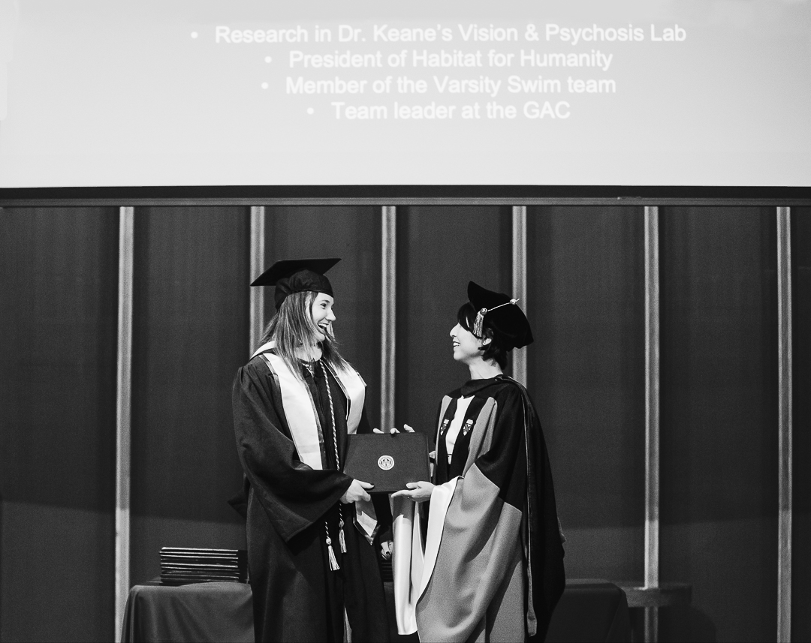
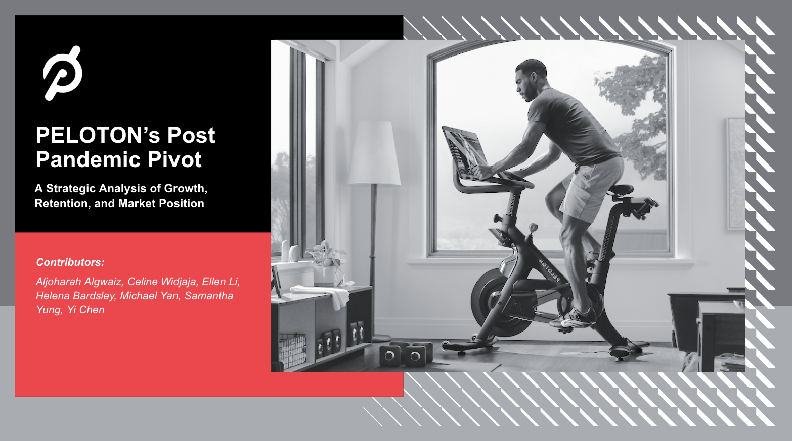
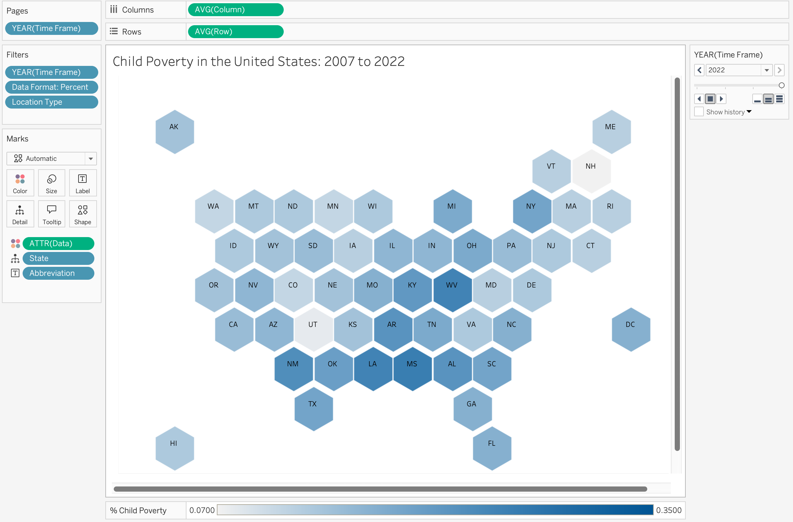
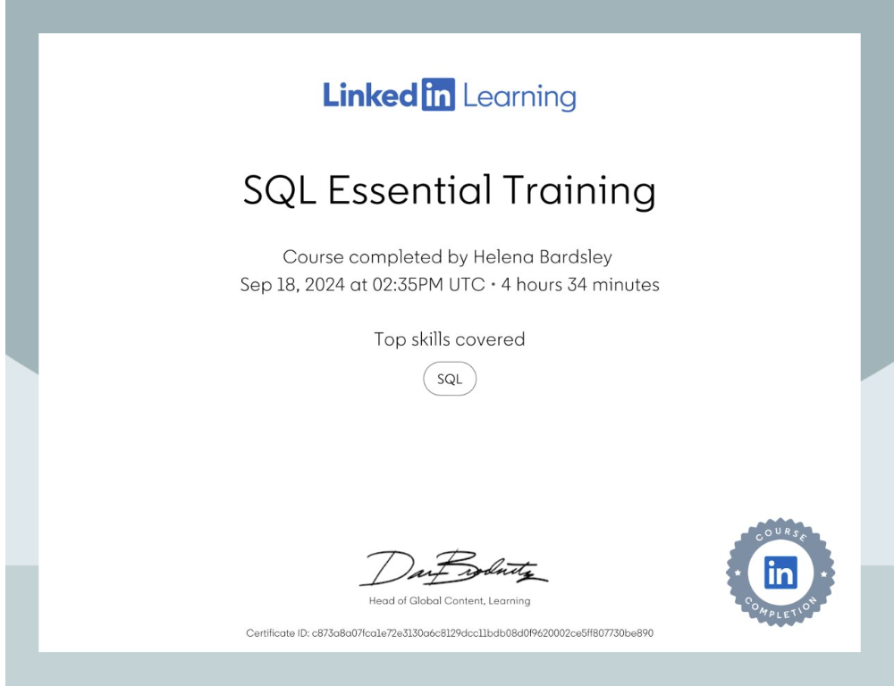
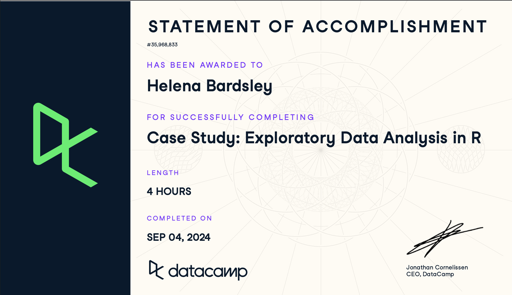
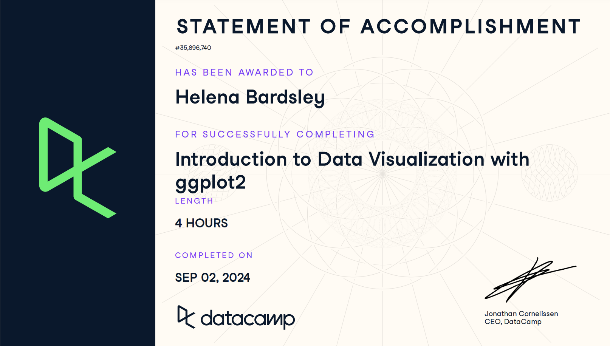
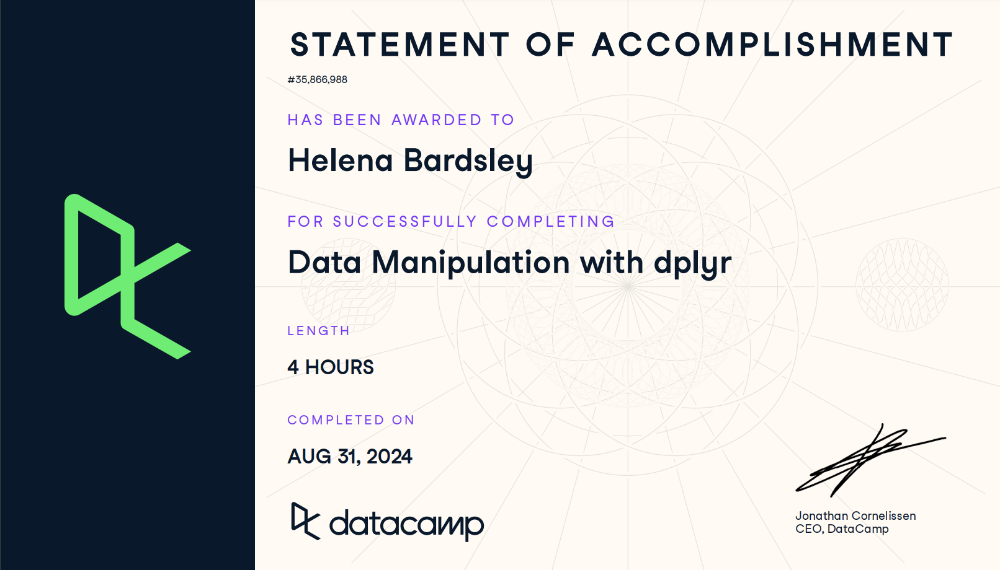
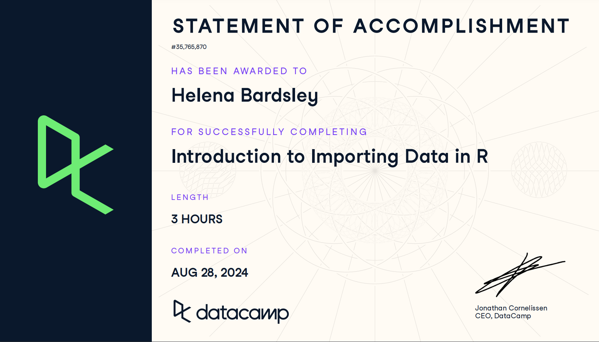
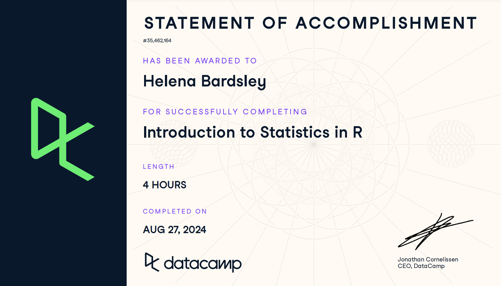
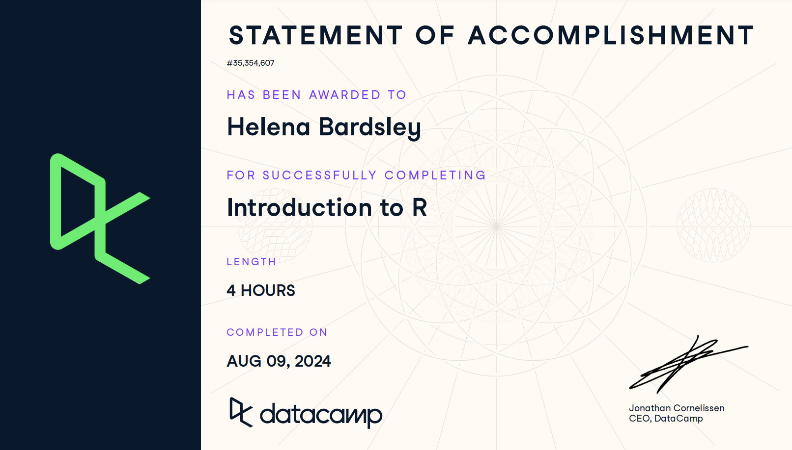

# Portfolio

  
Table of Contents

  <a href="https://github.com/helenabardsley/portfolio/#about">About Me</a>
  <a href="https://github.com/helenabardsley/portfolio/blob/main/index.md#projects">Projects</a>
  <a href="https://github.com/helenabardsley/portfolio/blob/main/index.md#skills">Skills</a>

---
## About Me
---

 Hi, I'm Helena, a <b>data-driven storyteller</b> who enjoys visualizing complex insights to reveal the bigger picture, and translating them into actionable strategies. 
 
 

 I realized how transformative data can be a couple of years ago, when my parents were moving and my mom unearthed a box containing a mountain of data, all about me. I found myself pouring over everything from developmental assessments to IQ tests, standardized test results to head circumference monitoring. My speech and large skull had produced years of data, while annual school district testing compared my progress to peers from both my school and across the state, using an array of visualization tools. I have always enjoyed statistics and dealing with data in my classes and research, but seeing analysis about my own development, most of it from a time I don’t remember, was especially fascinating and insightful and it has helped me understand myself better. The realization that data provides insight for arguably everything, including the projection of my own development, fueled my passion for data-driven research. 

 

 My choice to double major in Brain and Cognitive Sciences (BS) and Psychology (BA), with a minor in Bioethics, was made to allow me to explore human decision making. Through the courses I have taken and the research experience I was fortnuate enough to partake in, this field, is something that continues to interest me and is something I hope to combine with data analysis as a career. I decided to further my education at Columbia University to combine what I have learned about human behavior with statistics. 

 

 

 As you read through my portfolio, I hope you begin to understand me, and how my experiences have shaped my interests, beyond just my resume. I want a career where I can make my mark with a positive impact on the world with data. 

---
## Projects
---
### Kaggle Competition: Predict Click-Through Rate (CTR) using Lasso, Ridge, XGBoost and LightGBM

Using R, I performed comprehensive <b>exploratory data analysis</b> to understand important variables, handled missing values, outliers, performed feature engineering, and ensembled machine learning models to predict CTR, all while not overfitting my predictive model. After testing a variety of different techniques, my best model used XGBoost and had a Residual Mean Squared Error (RMSE) of 0.06186, and out of all of my classmates in my program, I ranked <b>37/400</b>, which is approximately <b>top 10%</b> in the Kaggle leaderboard.

 

 

### Peloton's Post-Pandemic Pivot: A Strategic Analysis of Growth, Retention, and Market Position

 Since the COVID-19 pandemic, Peloton has seen a tremendous drop in their annual revenue. Working with a team, we leveraged competitor analysis, customer analysis, and market insights to identify growth oppertunities for Peloton in these post-pandemic times. We made an interactive tableau story to effectively present our project. 

 

 

### The Impact of Live-Stream Shopping on Large Fashion Brands: A Case Study at Zara

 Small fashion businesses on the TikTok shop have seen a lot of success using live-stream shopping due to the ease and convenience of using TikTok's platform to make an in-app purchase and enabling viewers to engage with the business in real-time to ask any questions or make comments. On the other hand, Zara, while a hugely successful company, has had their website's user interface (UI) criticized in the media for its poor usability, lack of navigational aids, and confusing layout. My group and I designed a study, which involved running multiple <b>simulation studies</b> in <b>R</b>, to evaluate the impact live-stream shopping could have for a larger company, like Zara, by defining success metrics and uncovering strategies to boost customer engagement and willingness to shop online. 

 

 

---
## Dashboards
---
### Visualizing Data on Maps in Tableau

Using <b>Tableau</b> dashboards, I visualized child poverty rates across the United States for every 5 years between 2007 and 2022. Not only did I learn how to visualize multiple layers and dimensions of data on a geographical map, but I also learned the importance color has on conveying your message and making your visualization easy to comprehend. 

 

 

---
## Education
### Columbia University
M.S., Applied Analytics
- GPA: 4.0

<b>Relevant Coursework:</b> 

### University of Rochester
B.S., Brain & Cognitive Sciences (Concentration: Artificial Intelligence and Machine Learning)

B.A., Psychology

Minor, Bioethics
- GPA: 3.8

<b>Relevant Coursework:</b> 

---
## Skills
---
### Technical Skills
Data Analysis and Insights
- <b>R, SQL,</b> and <b>Python</b> to uncover trends for strategic decision making
- <b>MATLAB</b>...

Data Visualization
- Create dashboards using <b>Tableau</b>

Predictive Analysis
- Apply regressions, clustering, stepwise modeling to forecast trends and outcomes

Risk Analysis
- <b>Excel</b> for modeling and assessing risks to inform business strategies

### Non-Technical Skills
Strategic Thinking
Collaboration
- Multiple group projects...

### Certifications

#### SQL Essential Training (LinkedIn, September 18th, 2024)

 I took this course because I had not yet had any coursework pertaining to <b>SQL</b>, but I knew it was a very prevelant coding language used in a variety of companies. In this course, I learned the <b>basic structure of databases</b>, how to retrieve and understand the data, and mastered important <b>SQL queries</b> 

 

 

#### Case Study: Exploratory Data Analysis in R (DataCamp, September 4th, 2024)

I was able to use the tools for data manipulation and data visualization that I learned in previous courses to a real dataset. I gained more practice and understanding of the <b>dplyr</b> and <b>ggplot2</b> packages in R, as well as learned about the <b>broom</b> package for tidying model output. This gave me a true understanding of what a start to finish exploratory analysis in data science is like.

 

 

#### Introduction to Data Visualization with ggplot2 (DataCamp, September 2nd, 2024)

In this course about data visualization in <b>R</b>, I was introduced to the principles of good visualizations and the grammar of graphic plotting concepts in the ggplot2 package. From this course, I learned how to make <b>complex exploratory plots</b>

 

 

#### Data Manipulation with dplyr (DataCamp, August 31st, 2024)

Using library <b>dplyr</b> in <b>R</b>, I learned how to transform and aggregrate my data, as well as how to add, remove, or change variables. I then applied the knowledge I learned to two different case studies, one exploring a dataset regarding counties in the USA, and the other applying tools I learned to a babynames dataset to explore trends of baby names in the USA.

 

 

#### Introduction to Importing Data in R (DataCamp, August 28th, 2024)

This course taught me how to import a variety of data formats into <b>R</b>, and how to approach analysis based on the format of data.

 

 

#### Introduction to Statistics in R (DataCamp, August 27th, 2024)

This course used a sales data case study where I was able to develop skills on how to calculate averages, use and create scatterplots between two numeric variables, and calculate correlation in <b>R</b>.

 

 

#### Introduction to R (DataCamp, August 9th, 2024)

This course refreshed me on the basics of R, including vectors, factors, lists, and data frames.

 

 

---
### Work Experience
Data Analyst
- project 1
Research Assistant

